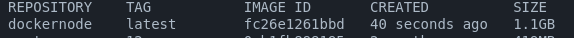
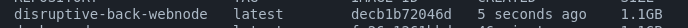
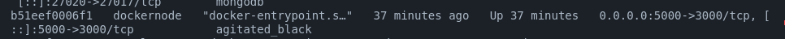
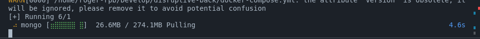
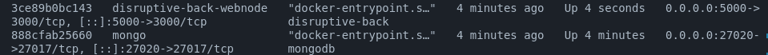

# Development 

En la terminal de la carpeta donde se encuentra dockerfile:
> **docker build -t dockernode .** 

para verificar que el contenedor se ha construido escriba en la terminal: 
>docker images

debería visualizar algo así:

ejecutando el contenedor:

>docker run -p 5000:3000 dockernode 

una vez realizado esto, se deberá construir el docker compose, de la siguiente manera: 

>docker-compose build --no-cache

debería visualizar algo así:

ahora deberá bajar la imagen de <b>dockernode</b> ejecutando:

> docker stop (primeras 3 letras del contenedor) 

ejemplo 

> docker stop ab1

> docker rm ab1

por último ejecutamos el comando:

>docker-compose up -d

una vez levantada ya tendremos 

## Verificar el contenedor

realizamos el siguiente comando 

>docker exec -it nombre del contenedor bash

ejemplo 

> docker exec -it  disruptive-back bash

al teclear ls, para mostrar los archivos del directorio actual en el que estamos nos daremos cuenta que estamos en el contenedor de nuestra aplicación, es decir que todo ok.

## Ejecutar la aplicación
Necesario el .env con las variables de

<b> JWT_KEY=secret

PASSWORD_ADMIN=1234 </b>

## Usuarios de la aplicación
Dentro de la carpeta seed, en user.seed.js se puede visualizar el usuario admin.

el password, lo especificaste en el punto anterior dentro de la variable `PASSWORD_ADMIN`, el email es admin@example.com.

## Roles 
'admin', 'lector', 'creador'

## 